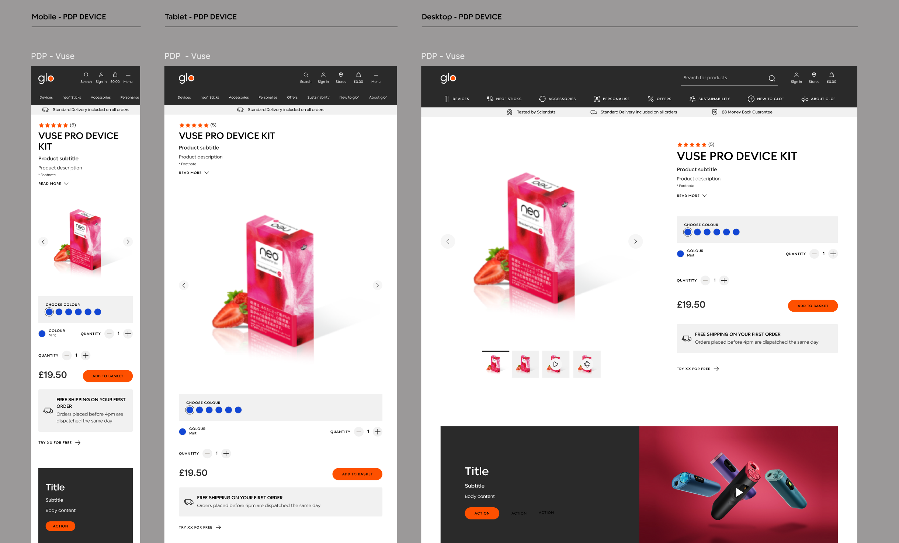
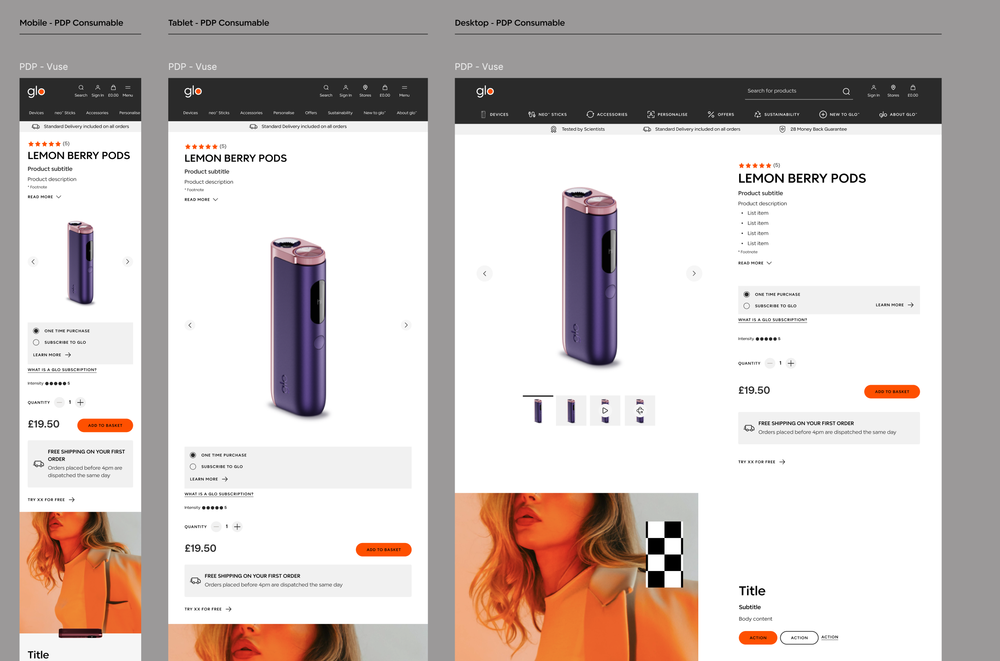

# Vuse PDP — Gap Analysis

> **Mockup source:** [vuse-pdp-device.png](../figmas/vuse-pdp-device.png), [vuse-pdp-consumable.png](../figmas/vuse-pdp-consumable.png) (Figma frames: `Mobile|Tablet|Desktop - PDP DEVICE`, `Mobile|Tablet|Desktop - PDP Consumable`).
> **Variants/states included:** **Device** variant (VUSE PRO DEVICE KIT) with colour swatches + one-time purchase only; **Consumable** variant (LEMON BERRY PODS) with one-time / subscribe purchase-mode radios and a 1–5 intensity meter. Each variant shown at three breakpoints (mobile, tablet, desktop). Out-of-stock / unconfigured / error / sold-out states are **not** in the mockup.
> **Scope:** **IN:** the PDP main column itself — gallery, product header (rating, title, subtitle, description, "read more", footnote), colour swatches (Device), purchase-mode + subscription block (Consumable), intensity meter (Consumable), quantity stepper, price, "Add to Basket" CTA, free-shipping banner, "Try XX for free" link, and the in-page authored promotion card (`Title / Subtitle / Body content / ACTION`) directly below the main column. **OUT:** header chrome (logo, mega-nav, search, account, basket icon), trust strip ("Tested by Scientists / Standard Delivery / 28 Money Back Guarantee"), mini-basket overlay, recommendations carousel (none shown in the mockup), footer chrome, age-gate, cookie banner, cart/checkout/account pages.
> **Author:** Jose Maria Franco · **Date:** 2026-06-15

The storefront sits on **Adobe Commerce as a Cloud Service (ACCS) + Edge Delivery Services (EDS)** using the **AEM Boilerplate Commerce** repo. The PDP is hosted by the thin `blocks/product-details` EDS block that mounts the modular per-area containers of [`@dropins/storefront-pdp`](https://experienceleague.adobe.com/developer/commerce/storefront/dropins/product-details/) — [`ProductGallery`](https://experienceleague.adobe.com/developer/commerce/storefront/dropins/product-details/containers/product-gallery/), [`ProductHeader`](https://experienceleague.adobe.com/developer/commerce/storefront/dropins/product-details/containers/product-header/), [`ProductShortDescription`](https://experienceleague.adobe.com/developer/commerce/storefront/dropins/product-details/containers/product-short-description/) / [`ProductDescription`](https://experienceleague.adobe.com/developer/commerce/storefront/dropins/product-details/containers/product-description/), [`ProductOptions`](https://experienceleague.adobe.com/developer/commerce/storefront/dropins/product-details/containers/product-options/), [`ProductQuantity`](https://experienceleague.adobe.com/developer/commerce/storefront/dropins/product-details/containers/product-quantity/), [`ProductPrice`](https://experienceleague.adobe.com/developer/commerce/storefront/dropins/product-details/containers/product-price/), [`ProductAttributes`](https://experienceleague.adobe.com/developer/commerce/storefront/dropins/product-details/containers/product-attributes/) — backed by **Catalog Service**. The host block owns the primary CTA (Add to Basket / Notify Me, [tutorial](https://experienceleague.adobe.com/developer/commerce/storefront/dropins/product-details/tutorials/notify-me-cta/)) and routes add-to-cart through [`@dropins/storefront-cart`](https://experienceleague.adobe.com/developer/commerce/storefront/dropins/cart/) (`addProductsToCart`). The deprecated monolithic `ProductDetails` container is **not** in scope — each section mounts independently.

### Mockups

**Device PDP** — colour swatches, no subscription/intensity:

**Consumable PDP** — purchase-mode radios (one-time / subscribe), intensity meter:

**Complexity buckets** (used in §2):
- **Low** — theming / config / authored content / single slot fill.
- **Medium** — new block logic, multi-slot wiring, drawer/state coordination, or initializing one additional drop-in.
- **High** — multi-block coordination plus a new service dependency or external-system integration.

---

## 1. Feature decomposition

One row per discrete feature observed in the design.

| # | Feature | Description in the design | Variant/state | Type | Observations |
|---|---------|---------------------------|---------------|------|--------------|
| F1 | Product gallery (main image + thumbnails + chevrons) | Square main image with `‹`/`›` chevrons either side; horizontal strip of 4 thumbnails below; thumbnails 1 and 3 appear to be still images, 2 a video poster, 4 an alternate angle. | Both | Commerce | Mockup hints at video (play icon on thumb 4 in Device, thumb 3 in Consumable); zoom is not shown but is a native option. |
| F2 | Star rating + count above title | Five filled orange stars and `(5)` count rendered above the product name. | Both | Commerce | **Ratings / review counts are not provided by Catalog Service or any drop-in**; require a third-party reviews provider. |
| F3 | Product name | Large bold uppercase heading — "VUSE PRO DEVICE KIT" / "LEMON BERRY PODS". | Both | Commerce | Native to `ProductHeader`. |
| F4 | Product subtitle | Small grey "Product subtitle" line under the name. | Both | Commerce | `ProductHeader` does not render a subtitle natively; surfaced from a Catalog Service attribute (e.g. `meta_title` or a custom `subtitle` attribute). |
| F5 | Short description + bullet list + footnote | "Product description" line on Device; on Consumable a "Product description" paragraph followed by three `• List item` bullets; both show "* Footnote" beneath. | Both | Commerce | Two rich-text bodies (short description / long description) plus a separate footnote attribute. |
| F6 | "Read more ∨" expand toggle | Collapsed description with a "READ MORE ∨" affordance to expand. | Both | Cross-cutting | Standard show/more pattern — not native to the description containers; host block adds a wrapper. |
| F7 | Colour swatch row ("CHOOSE COLOUR") | Six round colour swatches in a grouped card with the heading "CHOOSE COLOUR"; first swatch selected. Selected colour label rendered below as "COLOUR: <name>". | Device only | Commerce | Configurable product option; selected variant resolution via `getRefinedProduct`. |
| F8 | Purchase-mode radio (One-time / Subscribe to glo) | Two stacked radio rows inside a card — "ONE TIME PURCHASE" (selected) and "SUBSCRIBE TO GLO" with a "LEARN MORE →" link, followed by a "WHAT IS A GLO SUBSCRIPTION?" link. | Consumable only | Commerce | Adobe Commerce / drop-ins **do not ship a subscription-products feature**. Pricing model + frequency + life-cycle require an extension or external subscription service. (Same constraint as PLP F14.) |
| F9 | Intensity meter | "Intensity ●●●●○" — five circle glyphs reflecting strength on a 1–5 scale (4 filled in the mockup). | Consumable only | Commerce | Custom attribute display; intensity value is a product attribute exposed via Catalog Service. |
| F10 | Quantity stepper | "QUANTITY: − 1 +" inline stepper. On Device desktop the stepper appears twice (once next to the colour label, once below) — likely a mockup duplication. | Both | Commerce | Native to `ProductQuantity`. |
| F11 | Price | Single large price line — "£19.50". No strike-through / range / savings shown. | Both | Commerce | Native to `ProductPrice`. |
| F12 | Add to Basket CTA | Full-width / right-aligned orange primary button labelled "ADD TO BASKET". | Both | Commerce | Host-owned button; wires to `addProductsToCart` with selected `optionsUIDs` (Device) and subscription metadata (Consumable). |
| F13 | Free-shipping banner | Grey card with truck icon: "FREE SHIPPING ON YOUR FIRST ORDER / Orders placed before 4pm are dispatched the same day". | Both | Authored content | Static authored banner — not tied to subtotal/threshold logic (mirrors mini-basket F3). |
| F14 | "Try XX for free →" link | Plain text link below the free-shipping card. | Both | Authored content | Authored copy + link, not a Commerce control. |
| F15 | In-page promotion card | Below the main column: a two-up authored card — left a dark "Title / Subtitle / Body content / ACTION" panel (Device) or "ACTION / ACTION" two-CTA variant (Consumable), right a product/lifestyle image. | Both | Authored content | EDS authored section underneath the PDP block; not a drop-in feature. |
| F16 | Out-of-stock / Notify-Me state | Not shown in either mockup. | (missing) | Commerce | Documented OOTB pattern via host CTA + `pdp/data` `inStock` + `pdp/valid` event subscriptions. Flagged because the mockup is silent — need designs before estimating. |
| F17 | SEO / prerendered HTML | Not visible in the design but a hard requirement: PDP must emit canonical, title, OG/Twitter, JSON-LD, `<meta name="sku">` for the drop-in to read. | Both | Cross-cutting | The PDP drop-in renders client-side only; SEO depends on **AEM Commerce Prerender** writing the meta tags at build time. |

---

## 2. Gap analysis

Legend — **Coverage:** ✅ provided · 🟡 partial (slot / theme / extend) · ❌ none.

| # | Feature | Existing drop-in / block | Coverage | What it gives OOTB | Gap to close | Touch points | Dependencies | Complexity | Risk |
|---|---------|--------------------------|:--------:|--------------------|--------------|--------------|--------------|:----------:|:----:|
| F1 | Product gallery (main + thumbs + video) | [`ProductGallery`](https://experienceleague.adobe.com/developer/commerce/storefront/dropins/product-details/containers/product-gallery/) | ✅ | Carousel + thumbnails + chevrons + zoom + inline video (`videos: true`) + CDN-transformed images via `imageParams: {width, height}`; `slidesPerView`, `loop`, `controls` props; lazy thumbs and built-in skeleton. Custom thumb / main-image rendering via [`CarouselThumbnail`](https://experienceleague.adobe.com/developer/commerce/storefront/dropins/product-details/slots/) and [`CarouselMainImage`](https://experienceleague.adobe.com/developer/commerce/storefront/dropins/product-details/slots/) slots. | Enable `videos`, set `imageParams` tight for the above-the-fold main image to protect LCP, set `slidesPerView: 4` for the thumb strip, theme chevrons and active-thumb underline. | `blocks/product-details/product-details.js`, `product-details.css`, slot fills | media URLs in Catalog Service (or AEM Assets renditions if `commerce-assets-enabled`) | Low | Low |
| F2 | Star rating + review count | none native | ❌ | The PDP drop-in does not render ratings; Catalog Service does not return them. | Integrate a reviews provider (Bazaarvoice / Yotpo / PowerReviews / Trustpilot): server- or client-side fetch by SKU, render stars + `(n)` count above the title (own DOM under `ProductHeader`); also reuse the same component on the PLP card (mirrors PLP F11). Respect Core Web Vitals — lazy / batched fetch, no LCP impact. | new `blocks/product-details/reviews.js`, CSS | **third-party reviews provider** + per-SKU rating data; review-widget script for the full reviews section if also in scope | High | High |
| F3 | Product name | [`ProductHeader`](https://experienceleague.adobe.com/developer/commerce/storefront/dropins/product-details/containers/product-header/) | ✅ | Renders product name, SKU, brand, optional variant SKU/name from Catalog Service; `showVariantSku` / `showVariantName` props. | Restyle to uppercase / type tokens. | `product-details.css` | — | Low | Low |
| F4 | Product subtitle | `ProductHeader` — partial | 🟡 | No native subtitle field; `ProductHeader` exposes name, SKU, brand. | Add a custom Catalog Service attribute (e.g. `subtitle`) and render it under the title via the [`Attributes` slot](https://experienceleague.adobe.com/developer/commerce/storefront/dropins/product-details/slots/) on [`ProductAttributes`](https://experienceleague.adobe.com/developer/commerce/storefront/dropins/product-details/containers/product-attributes/) (positioned above other attributes) or as a sibling DOM node hydrated from `pdp/data`. | `product-details.js` (host DOM under `ProductHeader`), Catalog Service attributes config | `subtitle` attribute exposed by Catalog Service | Low | Low |
| F5 | Short description + bullets + footnote | [`ProductShortDescription`](https://experienceleague.adobe.com/developer/commerce/storefront/dropins/product-details/containers/product-short-description/) + [`ProductDescription`](https://experienceleague.adobe.com/developer/commerce/storefront/dropins/product-details/containers/product-description/) + [`ProductAttributes`](https://experienceleague.adobe.com/developer/commerce/storefront/dropins/product-details/containers/product-attributes/) | 🟡 | Both description containers render rich text from Catalog Service; `ProductAttributes` renders the key/value list. Bullet lists work natively if authored as `<ul>` in the description HTML. | Author the bullets inside the short-description HTML; surface the footnote via a dedicated Catalog Service attribute rendered through the [`Attributes` slot](https://experienceleague.adobe.com/developer/commerce/storefront/dropins/product-details/slots/) (italic small caption styling). | `product-details.css`, Catalog Service description + footnote attribute | Catalog data authored with the correct HTML | Low | Low |
| F6 | "Read more ∨" expand toggle | none native | ❌ | Description containers render the full body — there is no collapse/expand wrapper. | Build a thin client-side toggle around the description container (CSS `max-height` + button); persist open/closed state per page load only. | `product-details.js`, `product-details.css` | — | Low | Low |
| F7 | Colour swatch row + selected-colour label (Device) | [`ProductOptions`](https://experienceleague.adobe.com/developer/commerce/storefront/dropins/product-details/containers/product-options/) | ✅ | Renders configurable swatches (colour / size / image / text); fires `onValues` on change; auto-calls `getRefinedProduct` so price/SKU/gallery refresh. Custom swatch rendering via the [`Swatches`](https://experienceleague.adobe.com/developer/commerce/storefront/dropins/product-details/slots/) / [`SwatchImage`](https://experienceleague.adobe.com/developer/commerce/storefront/dropins/product-details/slots/) slots. | Mount inside a card with the "CHOOSE COLOUR" heading; render the "COLOUR: <name>" label by subscribing to `pdp/values` and reading the resolved option label from `pdp/data`. | `product-details.js` (`ProductOptions` mount + label hook), `product-details.css` | configurable Vuse Pro Device product in Commerce with colour attribute + hex per swatch | Low | Med |
| F8 | Purchase-mode radio + subscription (Consumable) | none native | ❌ | Adobe Commerce / drop-ins **do not ship a subscription-products feature**. There is no native "subscribe / one-time" pricing model on Catalog Service or cart. | Either (a) integrate a subscription-management extension / SaaS that exposes subscription SKUs + recurring price + frequency, or (b) author "subscription" as a configurable product option with discounted price. Either way the PDP needs: a custom radio block (DOM owned by the host, sibling to `ProductOptions`) with the two rows, the "LEARN MORE →" link, the "WHAT IS A GLO SUBSCRIPTION?" link/modal, and the click handler must pass the subscription metadata into `addProductsToCart`. Cart and checkout must also be ready for the recurring-billing flow (out of scope here; see PLP gap F14 and dedicated subscription gap doc). | `product-details.js`, `product-details.css`, cart and checkout blocks (separate gap) | **subscription service / extension** (e.g. Ordergroove, Recharge-equivalent, or an Adobe-aligned subscription extension); pricing-model decision | High | High |
| F9 | Intensity meter (Consumable) | none native | 🟡 | No native attribute-meter UI; the value can be exposed via Catalog Service if added as a product attribute (`intensity`, 1–5). | Extend the Catalog Service attribute set to include `intensity`; render the 5-dot meter via the [`Attributes` slot](https://experienceleague.adobe.com/developer/commerce/storefront/dropins/product-details/slots/) on [`ProductAttributes`](https://experienceleague.adobe.com/developer/commerce/storefront/dropins/product-details/containers/product-attributes/) (custom renderer when the attribute key is `intensity`). Reuse the same component on the PLP card (mirrors PLP F13). | Catalog Service attribute config, `product-details.js` slot fill, CSS | `intensity` attribute exposed on catalog | Low | Med |
| F10 | Quantity stepper | [`ProductQuantity`](https://experienceleague.adobe.com/developer/commerce/storefront/dropins/product-details/containers/product-quantity/) | ✅ | Stepper bound to `pdp/values.quantity`; minus / input / plus controls; min/max from Catalog Service. | Mount once (resolve the apparent duplicate stepper on Device desktop with design — see open question #1); restyle to design tokens. | `product-details.js`, `product-details.css` | — | Low | Low |
| F11 | Price | [`ProductPrice`](https://experienceleague.adobe.com/developer/commerce/storefront/dropins/product-details/containers/product-price/) | ✅ | Renders regular / final / range / savings from Catalog Service, with currency from the store-view config. | Mount + restyle; ensure currency follows the active store-view (no hard-coding). | `product-details.css`, store config | currency per store-view | Low | Low |
| F12 | Add to Basket CTA (incl. Notify Me when OOS) | host-owned button + [`@dropins/storefront-cart`](https://experienceleague.adobe.com/developer/commerce/storefront/dropins/cart/) (`addProductsToCart`) | ✅ | The CTA is **not** a slot — host pattern is documented: eager subscriptions to `pdp/data`, `pdp/valid`, `cart/data` drive the button label (`Add to Cart` / `Notify Me` / `Update in Cart`); `addProductsToCart({ sku, parentSku, quantity, optionsUIDs })` is the cart call. | Mount the SDK [`Button`](https://experienceleague.adobe.com/developer/commerce/storefront/sdk/components/button/) (or boilerplate button), wire the three event subscriptions, pass `optionsUIDs` from `getProductConfigurationValues()` and (Consumable) subscription metadata from F8; emit `cart/product/added` so the mini-basket auto-opens (see mini-basket F1). | `product-details.js`, `product-details.css` | cart drop-in initialized; mini-basket overlay (separate gap) | Medium | Low |
| F13 | Free-shipping banner | authored content + EDS section / fragment | ✅ | Static authored block placed under the price/CTA cluster — identical pattern to mini-basket F3. | Author the banner once and reuse via an EDS fragment; theme the orange + truck icon. | `product-details.js` (slot for authored content), CSS, fragments | — | Low | Low |
| F14 | "Try XX for free →" link | authored content | ✅ | Plain link styled as a CTA. | Author the copy + URL; theme as tertiary link. | authored content, CSS | resolved target URL | Low | Low |
| F15 | In-page promotion card (Title / Subtitle / Body / ACTION) | authored EDS section under the PDP block | ✅ | Standard EDS authored block (image + copy + CTA — two-CTA variant on Consumable). | Author the block (reuse a generic "promo-card" EDS block); place it after the PDP block in the page document. | EDS `promo-card` (or equivalent) block, page document | — | Low | Low |
| F16 | OOS / Notify Me state | host CTA + `pdp/data.inStock` + `pdp/valid` (+ optional back-in-stock backend) | 🟡 | Documented [Notify Me CTA tutorial](https://experienceleague.adobe.com/developer/commerce/storefront/dropins/product-details/tutorials/notify-me-cta/) — when `inStock === false` the button label flips to "Notify Me" with no cart icon and is enabled regardless of config validity. | Implement the tutorial (eager subscriptions to `pdp/data`, `pdp/valid`, `cart/data`); on Notify-Me click, open a lightweight email-capture modal or POST to a back-in-stock endpoint; persist email + SKU. **Confirm OOS visual design** with stakeholders before estimating exactly. | `product-details.js`, host modal/form, new `/api/back-in-stock` endpoint or marketing integration | **back-in-stock backend** (Adobe Journey Optimizer, ESP, or custom); `inStock` reliably returned by Catalog Service | Medium | Med |
| F17 | SEO / prerendered HTML (title, OG, JSON-LD, `<meta name="sku">`) | [AEM Commerce Prerender](https://experienceleague.adobe.com/developer/commerce/storefront/setup/configuration/aem-prerender/) | 🟡 | Prerender writes per-PDP `<title>`, canonical, OG, Twitter, JSON-LD `Product` schema, and `<meta name="sku">` so the drop-in can read it on init. | Provision and configure Prerender against the Catalog Service endpoint; verify JSON-LD includes price, availability, brand, image, ratings (if F2 ships); validate canonical URL strategy for variants. | Prerender config, `metadata.js`, head template | Prerender service provisioned; SKU-to-URL strategy defined | Medium | Med |

---

## 3. Overall assumptions and open questions

### 1. Assumptions
   - The PDP is the boilerplate `product-details` block mounting the modular per-area `@dropins/storefront-pdp` containers — **not** the deprecated monolithic `ProductDetails` container, and not a from-scratch component.
   - SKU is resolved from `<meta name="sku">` written by AEM Commerce Prerender (per Adobe's "read SKU from meta tag, not URL slug" guidance).
   - Catalog Service is licensed and provisioned on the ACCS backend; falling back to Core `products` is not planned.
   - Product imagery is delivered via Catalog Service URLs unless `commerce-assets-enabled` is later turned on; AEM Assets DAM integration is **not** assumed in MVP.
   - The Device PDP product is a **configurable** product with a `color` attribute driving the swatch group; selecting a swatch resolves a child SKU via `getRefinedProduct`.
   - The Consumable PDP is a simple product per flavour (Lemon Berry, etc.); subscription is layered on top of the simple product (not its own product type), via the chosen subscription mechanism (see open question #1).
   - The free-shipping banner and "Try XX for free →" link are static authored content, not driven by cart subtotal logic or personalization.
   - One reviews provider is used across PDP + PLP card; the same component is shared.
   - One store-view per locale; price/currency comes from the active store-view (no per-page currency switching).
   - The in-page promotion below the PDP (F15) is authored — not personalized via Adobe Target / `@dropins/storefront-personalization` in MVP.

### 2. Open questions

Decisions blocking the estimate. Each carries a recommendation and the impact of each option.

1. **Subscription pricing model (F8) — Adobe Commerce subscription extension, third-party subscription SaaS, or "configurable product" workaround?**
   - *Recommendation:* third-party subscription SaaS with a clear cart/checkout integration contract (e.g. Ordergroove / Recharge-equivalent), unless the merchant already has an Adobe-aligned subscription extension. Single decision across **PDP (F8)**, PLP (F14), cart, checkout, and account "manage subscriptions".
   - *Impact A — subscription extension / SaaS:* significant scope across catalog, PDP, PLP card, cart, checkout, and account; recurring billing, frequency UI, manage-subscription account screens; F8 and the Add-to-Basket wiring inflate considerably.
   - *Impact B — configurable-product workaround (one-time vs subscribe as a `purchase_mode` option):* much smaller; loses true recurring billing and account-level subscription management; not viable if the merchant truly needs recurring orders.

2. **Reviews and ratings provider (F2) — which platform, and is it in MVP?**
   - *Recommendation:* defer to phase 2 unless a provider is already chosen; if in MVP, prefer a provider with a documented JS SDK + per-SKU bulk fetch and a server-side render path for the rating snippet so it can land in JSON-LD.
   - *Impact A — third-party reviews (Bazaarvoice / Yotpo / PowerReviews) in MVP:* XL scope — per-SKU rating + count for PDP header **and** PLP card; lazy/batched fetch to protect CWV; full PDP review widget (separate gap doc); JSON-LD `aggregateRating` integration with Prerender.
   - *Impact B — drop ratings from MVP:* F2 collapses to nothing on PDP and a name-only restyle on PLP F11; revisit when a provider is selected.

3. **Back-in-stock notifications (F16) — Adobe Journey Optimizer / Commerce extension / lightweight in-house service?**
   - *Recommendation:* Adobe Journey Optimizer (AJO) or the merchant's existing ESP, called via a thin server endpoint; avoid building stock-watcher logic in the browser.
   - *Impact A — AJO / ESP:* moderate work — email capture form + server endpoint + journey config; clean separation; single endpoint reused by PLP F16.
   - *Impact B — bespoke in-house service:* additional backend ownership, stock-watch jobs, dedupe, unsubscribe; raises Risk on F16.

4. **Duplicate quantity stepper on Device desktop (F10) — mockup error or intentional?**
   - *Recommendation:* assume mockup duplication; render the stepper **once**, next to the price / Add to Basket cluster, matching the Consumable layout.
   - *Impact A — one stepper:* zero extra work; cleaner Universal Editor wiring (one `ProductQuantity` mount).
   - *Impact B — two synchronized steppers:* both must subscribe to `pdp/values.quantity` to stay in sync; adds CSS coordination and a small risk of state drift.

5. **OOS / sold-out / error designs (F16) — not in the mockup.**
   - *Recommendation:* request OOS, "configuration required", and "add-to-cart error" designs before estimating, then apply the Notify Me CTA tutorial exactly.
   - *Impact A — designs provided:* F16 sized accurately; back-in-stock endpoint scoped.
   - *Impact B — left undefined:* F16 carries design risk and likely rework; Notify-Me modal style is guessed.

6. **Colour-swatch source (F7) — Catalog Service `color` attribute with hex values, or a separate mapping?**
   - *Recommendation:* Catalog Service `color` attribute with a hex value per option (cleanest, drives both PDP swatch and PLP filter swatch — mirrors PLP F7).
   - *Impact A — hex on the attribute:* zero authoring overhead per locale; swatch renderer reads the value directly.
   - *Impact B — separate mapping (block-table / spreadsheet):* extra authoring surface; needed if the brand colour shifts per market.

7. **Gallery video source (F1) — Catalog Service video field, AEM Assets video, or external (YouTube/Vimeo)?**
   - *Recommendation:* Catalog Service video field with `videos: true` on `ProductGallery` (no extra dependency); fallback to AEM Assets when `commerce-assets-enabled` is on.
   - *Impact A — Catalog Service videos:* enabled by a single prop; no new SDK.
   - *Impact B — external embed (YouTube):* extra `CarouselMainImage` slot fill rendering the embed; consent-banner / cookie implications.

8. **SEO strategy for variant URLs (F17) — one canonical PDP per parent SKU, or per child SKU?**
   - *Recommendation:* one canonical PDP per parent (`/products/vuse-pro-device-kit`) with variant selection persisted via URL params (`persistURLParams: true`); JSON-LD describes the parent, with `hasVariant` entries.
   - *Impact A — canonical parent:* avoids near-duplicate indexed pages; cleaner sharing URL.
   - *Impact B — canonical per child:* better targeted SEO per colour/flavour, more indexed URLs, more Prerender generation cost.

## 4. Explicitly out of scope

What the estimate must **not** include — protects against scope creep in the estimation session.

- Header chrome (logo, mega-nav: DEVICES, NEO STICKS, ACCESSORIES, PERSONALISE, OFFERS, SUSTAINABILITY, NEW TO GLO, ABOUT GLO; search box; sign-in; store; basket icon) — covered by the header gap analysis.
- **Trust strip** ("Tested by Scientists / Standard Delivery included on all orders / 28 Money Back Guarantee") — authored chrome between header and PDP; not PDP functionality.
- Mini-basket overlay — covered in `minibasket-gap-analysis.md`; only `cart/product/added` emission from F12 is in scope here.
- Recommendations rail (PDP-attached cross-sell / "you may also like") — not shown in this mockup; covered by the recommendations gap.
- Reviews widget body (full list of reviews under the PDP) — separate gap; only the rating + count summary in F2 is sized here.
- Footer chrome and payment icons — covered by the footer gap analysis.
- PLP (covered in `plp.md`), cart, checkout, place-order, payment, address.
- Account, orders, returns, addresses, **manage-subscriptions** self-service.
- Age-gate / `(18+)` consent enforcement, cookie banner, and consent-management platform integration.
- Reviews-platform integration itself (Bazaarvoice / Yotpo / PowerReviews) — treated as a dependency (open question #2).
- Subscription service / recurring billing platform itself — treated as a dependency (open question #1).
- Back-in-stock backend (AJO / ESP / custom) itself — treated as a dependency (open question #3).
- Adobe Target / Personalization-driven merchandising of F15 (open question handled inline).
- AEM Assets DAM integration for product imagery, unless `commerce-assets-enabled` is later turned on.
- B2B variations (negotiable quotes, requisition lists, quick order, grid ordering for configurables).
- Multi-currency / price-book switching unless multistore expansion is later confirmed.
- Universal Editor authoring instrumentation of the PDP block (assumed handled by the boilerplate's UE wiring).
- Lighthouse / CWV tuning beyond setting `imageParams` and respecting lazy-load — covered in the performance/SEO doc.

---

## 5. References

### Curated skill references (read while preparing this doc)
- `accs-storefront-architect/references/dropin-product-details.md` — `@dropins/storefront-pdp` v3.0.2: modular containers (`ProductGallery`, `ProductHeader`, `ProductPrice`, `ProductOptions`, `ProductQuantity`, `ProductShortDescription` / `ProductDescription`, `ProductAttributes`, `ProductDownloadableOptions`, `ProductGiftCardOptions`), `pdp/data` / `pdp/values` / `pdp/valid` events, slot inventory (`Swatches`, `SwatchImage`, `CarouselThumbnail`, `CarouselMainImage`, `Attributes`), `getRefinedProduct`, Notify Me CTA host pattern.
- `accs-storefront-architect/references/dropin-cart.md` — `addProductsToCart({ sku, parentSku, quantity, optionsUIDs })` contract; `cart/product/added` event for mini-basket auto-open.
- `accs-storefront-architect/references/dropins-overview.md` — slots-before-overrides decision rule; extend-vs-create guidance; `provider.render(Container, props)(element)` mount signature; per-area container migration from deprecated `ProductDetails`.
- `accs-storefront-architect/references/services-and-graphql.md` — Catalog Service `products(skus: [sku])` shape; `commerce-endpoint` (CS) vs `commerce-core-endpoint` headers.
- `accs-storefront-architect/references/configuration.md` — `config.json` keys (`commerce-assets-enabled`, store-view headers); AEM Commerce Prerender wiring.
- `accs-storefront-architect/references/llms-full.txt` — direct verbatim reads for:
  - Modular PDP container list and migration from deprecated `ProductDetails` — lines ≈3089–3150.
  - Notify Me CTA host pattern (eager subscriptions to `pdp/data`, `pdp/valid`, `cart/data`; `getProductConfigurationValues()`) — lines ≈39684–39840.
  - `inStock` flag on `pdp/data` payload — lines ≈38389, 38673.

### Adobe official documentation (canonical URLs)
- Product Details drop-in overview — `https://experienceleague.adobe.com/developer/commerce/storefront/dropins/product-details/`
- Initialization — `https://experienceleague.adobe.com/developer/commerce/storefront/dropins/product-details/initialization/`
- Functions (`getRefinedProduct`, `getProductConfigurationValues`, `setProductConfigurationValues`) — `https://experienceleague.adobe.com/developer/commerce/storefront/dropins/product-details/functions/`
- Events (`pdp/data`, `pdp/values`, `pdp/valid`) — `https://experienceleague.adobe.com/developer/commerce/storefront/dropins/product-details/events/`
- Slots (`Attributes`, `Swatches`, `SwatchImage`, `CarouselThumbnail`, `CarouselMainImage`) — `https://experienceleague.adobe.com/developer/commerce/storefront/dropins/product-details/slots/`
- Notify Me CTA tutorial — `https://experienceleague.adobe.com/developer/commerce/storefront/dropins/product-details/tutorials/notify-me-cta/`
- Containers index — `https://experienceleague.adobe.com/developer/commerce/storefront/dropins/product-details/containers/`
- `ProductGallery` — `https://experienceleague.adobe.com/developer/commerce/storefront/dropins/product-details/containers/product-gallery/`
- `ProductHeader` — `https://experienceleague.adobe.com/developer/commerce/storefront/dropins/product-details/containers/product-header/`
- `ProductPrice` — `https://experienceleague.adobe.com/developer/commerce/storefront/dropins/product-details/containers/product-price/`
- `ProductOptions` — `https://experienceleague.adobe.com/developer/commerce/storefront/dropins/product-details/containers/product-options/`
- `ProductQuantity` — `https://experienceleague.adobe.com/developer/commerce/storefront/dropins/product-details/containers/product-quantity/`
- `ProductShortDescription` — `https://experienceleague.adobe.com/developer/commerce/storefront/dropins/product-details/containers/product-short-description/`
- `ProductDescription` — `https://experienceleague.adobe.com/developer/commerce/storefront/dropins/product-details/containers/product-description/`
- `ProductAttributes` — `https://experienceleague.adobe.com/developer/commerce/storefront/dropins/product-details/containers/product-attributes/`
- Cart drop-in — `https://experienceleague.adobe.com/developer/commerce/storefront/dropins/cart/`
- Cart events (`cart/product/added`, `cart/data`) — `https://experienceleague.adobe.com/developer/commerce/storefront/dropins/cart/events/`
- AEM Commerce Prerender — `https://experienceleague.adobe.com/developer/commerce/storefront/setup/configuration/aem-prerender/`
- SDK `Button` component — `https://experienceleague.adobe.com/developer/commerce/storefront/sdk/components/button/`
- AEM Boilerplate Commerce repo — `https://github.com/hlxsites/aem-boilerplate-commerce`
- Notify Me reference PR — `https://github.com/hlxsites/aem-boilerplate-commerce/pull/1116`

### Project artefacts
- `_templates/page-gap-analysis.template.md` — the structural template this document follows.
- `plp.md` — sibling gap doc; F7 (colour swatch), F13 (intensity meter), F14 (subscription pricing), F11 (reviews) and F16 (back-in-stock) share dependencies and component reuse with this doc.
- `minibasket-gap-analysis.md` — sibling gap doc; `cart/product/added` (F12) drives the mini-basket overlay; free-shipping banner authoring pattern (F13) mirrors mini-basket F3.
- `figmas/vuse-pdp-device.png`, `figmas/vuse-pdp-consumable.png` — primary design sources.
