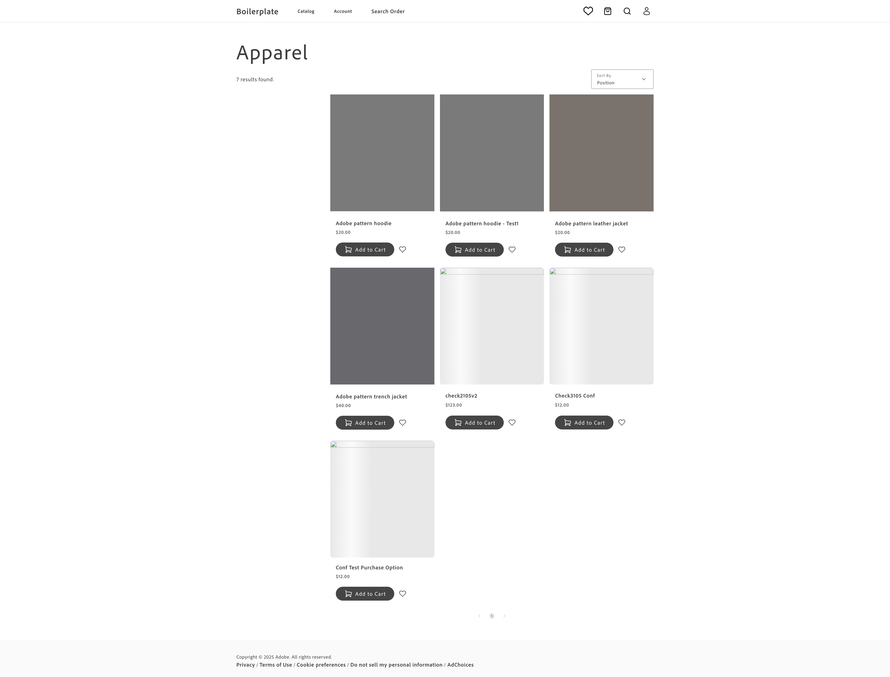

# Product Listing Page (PLP) — Gap Analysis

> **Author:** Jose Maria Franco · **Date:** 2026-07-07

The red-outlined block:

- Calls Adobe Commerce as a Cloud Service (ACCS) to fetch and render the product grid, covering simple, configurable, and bundle products.
- For configurable products, lets the shopper select a variant (e.g. nicotine strength) directly on the card.
- Shows a "One Time Purchase" / "Subscribe" choice on each card that belongs to a separate subscription feature and is intentionally out of scope here.
- Interleaves "in-page promotion" tiles in the grid, which must support arbitrary authored fragments/blocks, not just the static banner shown as the example — not a merchandising rule engine.
- On Add to Basket, adds the product to the cart and should conditionally reveal the mini-basket — the mini-basket UI itself is out of scope of this PLP feature.

## Boilerplate feature

Reference: [main--manistore--mariorodriguez-creator.aem.page/apparel](https://main--manistore--mariorodriguez-creator.aem.page/apparel?page=1&sort=&filter=)

---

## 1. Feature gap analysis

Legend — **Coverage:** ✅ provided · 🟡 partial (slot / theme / extend) · ❌ none.

| # | Feature | OOTB basis | Coverage | Gap to close | Dependencies & touch points | Complexity | Risk |
|---|---------|------------|:--------:|--------------|-----------------------------|:----------:|:----:|
| F1 | Sort control (`SORT`) `[C]` | [`@dropins/storefront-product-discovery`](https://experienceleague.adobe.com/developer/commerce/storefront/dropins/product-discovery/) → [`SortBy`](https://experienceleague.adobe.com/developer/commerce/storefront/dropins/product-discovery/containers/sort-by/) container | ✅ | Mount `SortBy`, theme the trigger button/icon to match VELO styling. | — | Low | Low |
| F2 | Filter trigger with active-count badge (`FILTER (2)`) `[C]` | [`Facets`](https://experienceleague.adobe.com/developer/commerce/storefront/dropins/product-discovery/containers/facets/) container, `scope: 'popover'` | ✅ | Mount `Facets` in popover scope behind a custom trigger button; derive the `(2)` count from the `SelectedFacets` slot data. | — | Low | Low |
| F3 | Quick-filter chip row (selected facet values shown inline, no drawer) `[C]` | `Facets` container → `Facet` / `FacetBucketLabel` / `SelectedFacets` slots | 🟡 | Build a custom slot renderer that surfaces a configured subset of facets as toggleable pills above the grid, kept in sync with the popover `Facets` state (same underlying search context). Neither `Facets` nor Catalog Service has a native "quick filter" designation, so a configuration mechanism is needed to select which facet(s) appear here (see §2 open question). | Config-driven attribute-code allow-list (e.g. in the PLP block config) | Medium | Low |
| F4 | Result count (`30 products`) `[C]` | `SearchResults` container → `Header` slot, `totalCount` from the search context | ✅ | Format and place `{totalCount} products` in the `Header` slot. | — | Low | Low |
| F5 | Product grid — renders simple, configurable, and bundle products from ACCS `[C]` | [`SearchResults`](https://experienceleague.adobe.com/developer/commerce/storefront/dropins/product-discovery/containers/search-results/) container, backed by [Catalog Service](https://experienceleague.adobe.com/developer/commerce/storefront/setup/), which maps configurable/bundle/grouped products to the complex-product query | 🟡 | Mount `SearchResults` in the PLP block against the `commerce-endpoint` GraphQL endpoint; branch `ProductActions` / `ProductPrice` slot rendering by product type (see F9, F10 for the type-specific behavior). | [Commerce configuration](https://experienceleague.adobe.com/developer/commerce/storefront/setup/configuration/commerce-configuration/) `commerce-endpoint`; touches the PLP EDS block and `SearchResults` slots | Medium | Low |
| F6 | Merchandising badges — `NEW` ribbon and per-product promo band (`PROMO HERE`) `[C]` | `SearchResults` container → `ProductImage` / `Header` slots; custom `models` transformer (e.g. `promotionBadge: data?.promotion?.label`) | 🟡 | Map the source Catalog attributes (new-product flag, promotion label) through a custom product model transformer, then render as badge markup in the relevant slots. | Confirm the backing Catalog/merchandising attributes exist and are exposed to Catalog Service | Low | Low |
| F7 | Star rating and review count `[C]` | none natively; assumed to be sourced from a third-party reviews API exposed to AEM through [Adobe API Mesh](https://developer.adobe.com/graphql-mesh-gateway/) as a single GraphQL endpoint | ❌ | Configure API Mesh to merge the third-party reviews API into the storefront's GraphQL schema, then surface star rating + review count via a custom slot in `ProductActions` or `Header`. | New third-party reviews service + Adobe API Mesh instance; touches build/deploy config and PLP card slots | High | High |
| F8 | Price display `[C]` | `SearchResults` container → `ProductPrice` slot | ✅ | Theme the price slot; for bundle products confirm "From" price formatting per F10. | — | Low | Low |
| F9 | Configurable variant selection in-card (e.g. strength `6MG` / `8MG` swatches) `[C]` | none in `SearchResults`; nearest equivalent is the Product Details drop-in's `ProductOptions` container → [`Swatches`](https://experienceleague.adobe.com/developer/commerce/storefront/dropins/product-details/) slot, which is PDP-only | 🟡 | Build a lightweight in-card swatch selector (reusing `Swatches` presentation/logic where practical) that updates the selected `optionsUIDs`/child SKU and price before add-to-basket. | Requires option/child-SKU data per card from the Catalog Service product query | High | Medium |
| F10 | Bundle product card — starting price / configure entry point `[C]` | none in `SearchResults` for inline bundle configuration; full bundle option selection lives in the Product Details drop-in's `ProductOptions` container | 🟡 | Detect bundle products in the grid and render a "From `{price}`" price plus a card action that routes to PDP for full configuration, instead of a direct add-to-basket. | Decision: bundle products route to PDP rather than configuring inline (see §2 Assumptions) | Medium | Medium |
| F11 | One Time Purchase / Subscribe selector on card `[C]` *out of scope* | — | — | **Excluded from this gap** — subscription vs. one-time-purchase selection is scoped as a separate feature. See §3. | — | — | — |
| F12 | Quantity stepper `[C]` | none in `SearchResults`; nearest equivalent is the Product Details drop-in's `ProductQuantity` container, which is PDP-only | 🟡 | Build an in-card quantity stepper (reusing `ProductQuantity` presentation/logic where practical) feeding the quantity into the add-to-basket call. | — | Medium | Low |
| F13 | Add to basket action `[C]` | [`@dropins/storefront-cart`](https://experienceleague.adobe.com/developer/commerce/storefront/dropins/cart/) → `addProductsToCart` function | 🟡 | Wire the `ADD TO BASKET` button to `addProductsToCart`, passing `sku`/`parentSku`/`quantity`/`optionsUIDs` sourced from F9/F12 for configurable products, plain `sku`/`quantity` for simple products. | Emits `cart/product/added` (consumed by the header/mini-cart — see F14) | Medium | Low |
| F14 | Add-to-basket conditionally opens the mini-basket `[X]` *mostly out of scope* | `@dropins/storefront-cart` emits `cart/product/added` on `addProductsToCart` | 🟡 | In scope: confirm the PLP add-to-basket call emits `cart/product/added` so a listener can react. **Out of scope:** the mini-basket UI/drawer that listens for this event and renders — tracked as a separate cross-cutting feature. See §3. | Cross-cutting with header/mini-basket block | Low | Low |
| F15 | In-page content slot for arbitrary authored fragments/blocks interleaved in the grid (mockup example: a static promotion banner) `[A]` | EDS [Fragment block](https://main--helix-website--adobe.hlx.page/developer/block-collection/fragment) — embeds the content of another authored document (with its own blocks) anywhere on a page; no `SearchResults` slot supports injecting content at an arbitrary position inside the rendered grid | 🟡 | Custom logic in the PLP block to interleave an authored Fragment reference at a configurable position within the rendered product grid — the Fragment block itself covers embedding any authored content (the banner in the mockup is just one example), the gap is positioning it inside a dynamically-rendered commerce grid. | Authoring: one fragment document per placement; touches the PLP block's grid-rendering logic | Medium | Low |
| F16 | "Load more" pagination — progress indicator (`You've viewed {n} of {total}`) plus a button that appends the next page to the grid `[C]` | [`Pagination`](https://experienceleague.adobe.com/developer/commerce/storefront/dropins/product-discovery/containers/pagination/) container — manages `pageInfo.currentPage`/`totalPages` internally, but ships numbered page-number navigation by default, not a cumulative append + progress-text pattern | 🟡 | Replace the default `Pagination` UI with a custom "Load more" button and progress text built from `pageInfo`/`totalCount`; accumulate newly fetched `SearchResults` items onto the existing grid instead of replacing them on page change. | Touches the PLP block's grid-rendering logic to accumulate results across pages | Medium | Low |

---

## 2. Overall assumptions and open questions

### 1. Assumptions
   - Catalog Service is already enabled and reachable via `commerce-endpoint` for this storefront (baseline requirement for any Product Discovery listing).
   - The subscription vs. one-time-purchase selector (F11) and its pricing logic are being estimated as a separate feature and are excluded here per the request.
   - The mini-basket drawer UI (F14) is being estimated as a separate cross-cutting feature; this PLP gap only covers emitting the add-to-cart event that would trigger it.
   - The wishlist heart icon shown on cards in the mockup is treated as a cross-cutting feature, estimated once and reused across PLP/PDP — excluded from this document.
   - Bundle products (F10) route to PDP for full option configuration rather than configuring inline in the grid.
   - Ratings/reviews (F7) are sourced from a third-party reviews API exposed to AEM through Adobe API Mesh as a single GraphQL endpoint — treated as a net-new integration.
   - Pagination (F16) is a "Load more" button plus a progress indicator (e.g. "You've viewed 24 of 191") that appends results to the grid, not numbered pagination.

### 2. Open questions

1. **Where should the quick-filter facet selection (F3) live — which facet(s) are surfaced as pills above the grid?** Neither the `Facets` container nor Catalog Service has a native "quick filter" designation for an attribute.
   - *Recommendation:* start with a config-driven attribute-code allow-list (e.g. in the PLP block's config), since no admin-facing setting exists for this today.
   - *Impact A — config-driven allow-list:* Medium complexity, as scoped; changing which facets show requires a config change and deploy.
   - *Impact B — merchant-configurable in Commerce Admin:* High complexity, requires building or extending an admin setting beyond what any drop-in exposes.

## 3. Explicitly out of scope

- Subscription vs. one-time-purchase selection and pricing (the `One Time Purchase` / `Subscribe` radio control and `WHAT IS A SUBSCRIPTION?` explainer) — tracked as a separate feature.
- The mini-basket/mini-cart drawer UI itself (rendering line items, subtotal, checkout CTA) — only the triggering add-to-cart event is in scope here.
- The wishlist heart icon on product cards — tracked as a separate cross-cutting feature reused across PLP/PDP.
- Page header, navigation, hero banner, and "Subscribe to VELO" banner above the PLP block — outside the red-boxed area in the mockup.
- Full inline bundle-product option configuration UI in the grid — bundle products route to PDP instead (see Assumptions).
- Procurement/contractual work for the third-party reviews provider and the Adobe API Mesh setup beyond the storefront-side GraphQL integration.

---

## Documentation URL reference

Use these canonical URLs when hyperlinking drop-ins, containers, and services in the document above.

### Drop-ins (B2C)

| Drop-in / concept | Root URL |
|-------------------|----------|
| All drop-ins — introduction, extend/create, styling, branding, events | https://experienceleague.adobe.com/developer/commerce/storefront/dropins/all/introduction/ |
| **Product Details** (`@dropins/storefront-pdp`) | https://experienceleague.adobe.com/developer/commerce/storefront/dropins/product-details/ |
| **Product Discovery** (`@dropins/storefront-product-discovery`) | https://experienceleague.adobe.com/developer/commerce/storefront/dropins/product-discovery/ |
| **Cart** (`@dropins/storefront-cart`) | https://experienceleague.adobe.com/developer/commerce/storefront/dropins/cart/ |
| **Checkout** (`@dropins/storefront-checkout`) | https://experienceleague.adobe.com/developer/commerce/storefront/dropins/checkout/ |
| **User Account** (`@dropins/storefront-account`) | https://experienceleague.adobe.com/developer/commerce/storefront/dropins/user-account/ |
| **User Auth** (`@dropins/storefront-auth`) | https://experienceleague.adobe.com/developer/commerce/storefront/dropins/user-auth/ |
| **Order** (`@dropins/storefront-order`) | https://experienceleague.adobe.com/developer/commerce/storefront/dropins/order/ |
| **Wishlist** (`@dropins/storefront-wishlist`) | https://experienceleague.adobe.com/developer/commerce/storefront/dropins/wishlist/ |
| **Payment Services** (`@dropins/storefront-payment-services`) | https://experienceleague.adobe.com/developer/commerce/storefront/dropins/payment-services/ |
| **Personalization** (`@dropins/storefront-personalization`) | https://experienceleague.adobe.com/developer/commerce/storefront/dropins/personalization/ |
| **Recommendations** (`@dropins/storefront-recommendations`) | https://experienceleague.adobe.com/developer/commerce/storefront/dropins/recommendations/ |

### Drop-ins (B2B)

| Drop-in | Root URL |
|---------|----------|
| B2B drop-ins overview | https://experienceleague.adobe.com/developer/commerce/storefront/dropins-b2b/ |
| **Company Management** | https://experienceleague.adobe.com/developer/commerce/storefront/dropins-b2b/company-management/ |
| **Company Switcher** | https://experienceleague.adobe.com/developer/commerce/storefront/dropins-b2b/company-switcher/ |
| **Purchase Order** | https://experienceleague.adobe.com/developer/commerce/storefront/dropins-b2b/purchase-order/ |
| **Quote Management** | https://experienceleague.adobe.com/developer/commerce/storefront/dropins-b2b/quote-management/ |
| **Requisition List** | https://experienceleague.adobe.com/developer/commerce/storefront/dropins-b2b/requisition-list/ |
| **Quick Order** | https://experienceleague.adobe.com/developer/commerce/storefront/dropins-b2b/quick-order/ |

### Configuration & services

| Topic | URL |
|-------|-----|
| Storefront setup overview | https://experienceleague.adobe.com/developer/commerce/storefront/setup/ |
| Commerce configuration (`config.json`) | https://experienceleague.adobe.com/developer/commerce/storefront/setup/configuration/commerce-configuration/ |
| Multistore setup | https://experienceleague.adobe.com/developer/commerce/storefront/setup/configuration/multistore-setup/ |
| Storefront Compatibility Package (install) | https://experienceleague.adobe.com/developer/commerce/storefront/setup/configuration/storefront-compatibility/install/ |
| B2B Compatibility Package | https://experienceleague.adobe.com/developer/commerce/storefront/setup/configuration/storefront-compatibility-b2b/ |
| AEM Assets configuration | https://experienceleague.adobe.com/developer/commerce/storefront/setup/configuration/aem-assets-configuration/ |
| AEM Commerce Prerender | https://experienceleague.adobe.com/developer/commerce/storefront/setup/configuration/aem-prerender/ |
| CDN configuration | https://experienceleague.adobe.com/developer/commerce/storefront/setup/configuration/content-delivery-network/ |
| CORS setup | https://experienceleague.adobe.com/developer/commerce/storefront/setup/configuration/cors-setup/ |
| Gated content | https://experienceleague.adobe.com/developer/commerce/storefront/setup/configuration/gated-content/ |
| Price Book setup | https://experienceleague.adobe.com/developer/commerce/storefront/setup/configuration/price-book-setup/ |
| Adobe API Mesh (multi-source GraphQL gateway) | https://developer.adobe.com/graphql-mesh-gateway/ |
